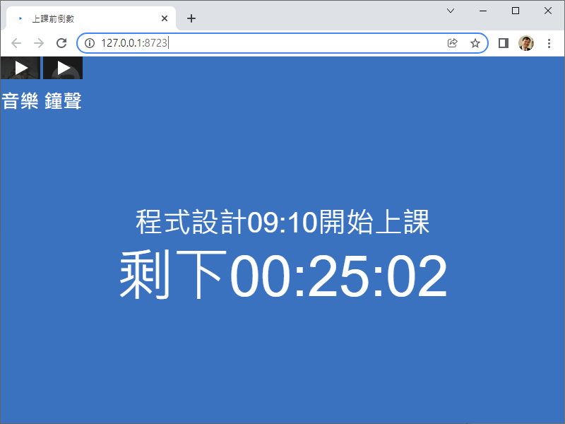

# 倒數計時
## Count Down for Google Meet

[【停課不停學、小孩在家學】Day 4: 2021/5/20(三) 倒數計時](https://www.facebook.com/jsyeh.org/posts/4342095909136532)

上課前, **你會提早到教室嗎**? 我每天上課時, 都會提到1個小時到教室準備。幸運的, 我看到了很多同學也會提早到教室準備, 這樣上課鐘響時, 就可以準時上課囉!

那麼, 線上上課時, 要怎麼讓大家提早到教室準備? 這幾天我在思考這個問題：「如何讓同學們可以 **提早進教室測試連線狀況**?」這時候, 我想到了很不錯的方法，就是 **提早開放教室**。可是可是... 同學提早進來, 看到沒有人、不知道要等多久, 就會很無聊啊! 所以凌晨就我就匆匆寫了一個倒數計時的程式, 可以設定好「開始時間、歡迎的字串」, 讓同學看到 **還要等多久上課鐘響**。 今天上課時, 就教大一學生寫「倒數計時」的程式。同學還蠻開心的。

但只有畫面、沒有聲音, 總覺得怪怪的。我想到可以使用 YouTube 找到輕鬆的音樂來播放, 但是在 Google Meet 裡, 又要倒數計時、又要播放電腦的音樂, 感覺有點難度。所以我就利用 <iframe></iframe> 把 YouTube影片內嵌在倒數計時的畫面中。這時就可以利用 Google Meet 分享畫面時, 選 Chrome 分頁 來播出聲音。 我真是太天才了, 想到這麼簡單的方法來解決 🙂 程式在這裡 https://github.com/jsyeh/countdown

## 使用方法
1. 把 countDownJS.zip 下載、解壓縮。 
2. 你可以 countDownJS 這個目錄, 用 Chrome 開啟裡面的 index.html 就好了 (Chrome設為預設 browser, 點2下 index.html 就好了)
3. 左上角有個小小的 YouTube 方塊, 點它,就會開始播音樂
4. 如果希望音樂停下來, 在 Chrome 裡按 F5 就恢復成還沒播放音樂的狀態

## 如何修改時間
1. 用文字編輯器(ex. Notepad++) 把 countDownJS.js 打開
2. 把 `let DestH=20;` 改成你要的目標時間(小時)
3. 把 `let destM=0;` 改成你要的目標時間(分鐘)
4. 把 `let destS=0;` 改成你要的目標時間(秒)
5. 再回到 Chrome 按 F5 重讀一次就更新了

## 如何修改訊息
1. 用文字編輯器(ex. Notepad++) 把 countDownJS.js 打開, 把裡面的中文改成你要放的訊息
2. 用文字編輯器(ex. Notepad++) 把 index.html 打開, 把裡面的 `<title>改你要的標題</title>`

## 如何修改音樂
1. 去 YouTube 裡挑你喜歡的輕音樂, 點選「Share分享」鍵, 複製 Embed `</>` 裡的 `<iframe ...></iframe>` 程式
2. 用文字編輯器(ex. Notepad++) 把 index.html 打開, 把下面的 `<iframe ...></iframe>` 換成成你喜歡的 YouTube `<iframe ...></iframe>`
3. 你可以把 width 及 height 設小一點, YouTube 按鈕就不會太大。